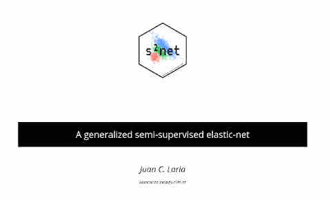

--- 
output: github_document
---

<!-- README.md is generated from README.Rmd. Please edit that file -->

```{r setup, include = FALSE}
knitr::opts_chunk$set(
  collapse = TRUE,
  comment = "#>",
  fig.path = "man/figures/README-",
  out.width = "100%"
)
```


## s2net  
[](https://travis-ci.org/jlaria/s2net)
`r badger::badge_code_size("jlaria/s2net")`
`r badger::badge_last_commit("jlaria/s2net")`
`r badger::badge_cran_release("s2net", "orange")`
`r badger::badge_github_version("jlaria/s2net", "blue")`


### Overview

R package `s2net`

 + Our method extends the supervised elastic-net problem, and thus it is a practical solution to the problem of feature selection in semi-supervised contexts.
 + Its mathematical formulation is presented from a general perspective, covering a wide range of models. 
 + We develop a flexible and fast implementation for `s2net` in `R`, written in `C++` using `RcppArmadillo` and integrated into `R` via `Rcpp` modules.


### Installation

You can install the released version of `s2net` from [CRAN](https://CRAN.R-project.org) with:

``` r
install.packages("s2net")
```

The development version can be installed with:

``` r
devtools::install_github("jlaria/s2net", build_vignettes = TRUE)
```

### Features

[](https://slides.com/juancarloslaria/deck#/)

### Example 

This is a basic example which shows you how to use the package. Detailed examples can be found in the documentation and vignettes. 

```{r}
library(s2net)
# Auto-MPG dataset is included for benchmark
data("auto_mpg")
```

Semi-supervised data is made of a labeled dataset `xL`, the labels `yL`, and unlabeled data `xU`.  Package `s2net` includes the function `s2Data` to process semi-supervised datasets. 

```{r}
head(auto_mpg$P2$xL, 2) # labeled data
head(auto_mpg$P2$yL, 2) # labels
head(auto_mpg$P2$xU, 2) # unlabeled data

train = s2Data(auto_mpg$P2$xL, auto_mpg$P2$yL, auto_mpg$P2$xU, preprocess = TRUE)

head(train$xL, 2)
```

The data is centered and scaled, and factor variables are automatically converted to numerical dummies. Constant columns are also removed. If we wanted to use validation/test data, we must pre-process it according to the training data, with:

```{r}
valid = s2Data(auto_mpg$P2$xU, auto_mpg$P2$yU, preprocess = train)
```

There are two ways to fit a semi-supervised elastic-net using `s2net`. The easiest way is using the function `s2netR`, that returns an object of S3 class `s2netR`.

```{r}
model = s2netR(train, params = s2Params(lambda1 = 0.01, lambda2 = 0.01, gamma1 = 0.01, gamma2 = 100, gamma3 = 0.1))

class(model)
model$beta

ypred = predict(model, valid$xL)
```

If we are fitting the semi-supervised elastic-net many times, using the same `train` data (for example, searching for the best hyperparameters), then it is faster to use the `C++` class `s2net` instead.

```{r}
obj = new(s2net, train, 0) # 0 = linear

# We fit the model with
obj$fit(s2Params(0.01, 0.01, 0.01, 100, 0.1), 0, 2) # frame = 0 (ExtJT), proj = 2 (auto)

obj$beta

ypred = obj$predict(valid$xL, 0) #0=default predictions
# or
ypred = predict(obj, valid$xL)
```

#### Further examples

More examples can be found in the package documentation and vignettes.

```{r, eval=FALSE}
vignette(package="s2net")
```


<!-- ## Example -->

<!-- This is a basic example which shows you how to solve a common problem: -->

<!-- ```{r example} -->
<!-- ## basic example code -->
<!-- ``` -->

<!-- What is special about using `README.Rmd` instead of just `README.md`? You can include R chunks like so: -->

<!-- ```{r cars} -->
<!-- summary(cars) -->
<!-- ``` -->

<!-- You'll still need to render `README.Rmd` regularly, to keep `README.md` up-to-date. -->

<!-- You can also embed plots, for example: -->

<!-- ```{r pressure, echo = FALSE} -->
<!-- plot(pressure) -->
<!-- ``` -->

<!-- In that case, don't forget to commit and push the resulting figure files, so they display on GitHub! -->
